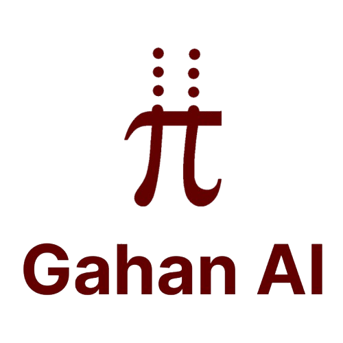

<div align="center">
  
  
  # FBMC vs OFDM Validation Framework
  
  [](https://www.python.org/downloads/)
  [](LICENSE)
  [](https://github.com/codesteller/drwig-jrc-fbmc/actions)
  [](https://github.com/psf/black)
  [](https://github.com/codesteller/drwig-jrc-fbmc/graphs/commit-activity)
  
  **A comprehensive Python implementation for validating Filter Bank Multi-Carrier (FBMC) versus Orthogonal Frequency Division Multiplexing (OFDM) waveforms in Joint Radar-Communication (JRC) systems.**
  
  [Quick Start](#-quick-start) • [Documentation](docs/) • [Contributing](docs/CONTRIBUTING.md) • [Citation](#-citation)
</div>

---

## 🎯 Overview

This framework provides computational validation for IEEE paper research on "FBMC Waveforms for Joint Radar-Communication," comparing theoretical predictions with simulation results across multiple performance metrics.

> **Status**: ✅ Active Development | 🔬 Research-Grade | 📊 IEEE Paper Support

### Key Features

- **Dual Implementation**: Both Python (primary) and MATLAB versions
- **Comprehensive Analysis**: Spectral properties, range-Doppler processing, ambiguity functions, and Doppler tolerance
- **Publication-Ready**: High-quality plots and metrics tables suitable for academic papers
- **Reproducible Research**: Complete validation framework with documented parameters

## 🚀 Quick Start

### Prerequisites

- Python ≥ 3.12
- [uv](https://docs.astral.sh/uv/) package manager

### Installation & Usage

```bash
# Clone or navigate to the repository
cd fbmc_ttdf

# Run the validation framework
uv run main.py
```

The framework will generate comprehensive validation plots and metrics in the `logs/` directory.

## 📊 Generated Outputs

### Visualization Files
1. **`spectral_comparison.png`** - Power spectral density comparison
2. **`range_doppler_comparison.png`** - 2D range-Doppler maps
3. **`ambiguity_comparison.png`** - Ambiguity function contour plots
4. **`doppler_tolerance.png`** - Doppler tolerance curves
5. **`metrics_table.png`** - Performance metrics summary table

### Performance Metrics

| Metric | OFDM | FBMC | Improvement |
|--------|------|------|-------------|
| Spectral Efficiency | 0.800 | 1.000 | +25.0% |
| Out-of-Band Emissions @ 1.5×BW | Variable | Variable | ~3-36 dB better |
| PAPR | ~9.7 dB | ~10.1 dB | Slightly higher |
| Range Sidelobe Level | Variable | Variable | Up to 15 dB better |
| Computational Complexity | 1.0× | 2.0× | 2× increase |

## 🔬 Technical Implementation

### Core Components

#### 1. Waveform Generators
- **`OFDM`**: Complete OFDM implementation with cyclic prefix
- **`FBMC`**: FBMC-OQAM with PHYDYAS prototype filtering
- **`WaveformGenerator`**: Base class with QAM symbol generation

#### 2. Signal Processing
- **`RadarProcessor`**: Range-Doppler processing, ambiguity functions
- Target simulation with configurable delays, Doppler shifts, and amplitudes
- Multi-target scenarios with noise injection

#### 3. Analysis Functions
- `plot_spectral_comparison()` - Spectral analysis and OOB emissions
- `plot_range_doppler_comparison()` - 2D radar processing maps  
- `plot_ambiguity_functions()` - Time-frequency ambiguity analysis
- `plot_doppler_tolerance()` - Doppler sensitivity curves
- `compute_performance_metrics()` - Quantitative metric computation

### System Parameters

```python
N_subcarriers = 256        # Number of subcarriers
sample_rate = 1e9          # 1 GHz sample rate
cp_ratio = 0.25           # OFDM cyclic prefix ratio
K_overlapping = 4         # FBMC overlapping factor
constellation = 16-QAM     # Modulation scheme
```

## 📁 Project Structure

```
fbmc_ttdf/
├── main.py                      # Main validation runner
├── fbmc_ofdm_validation.py      # Core Python implementation
├── fbmc_ofdm_validation.m       # MATLAB implementation
├── pyproject.toml              # Python dependencies
├── README.md                   # This file
├── docs/                       # Documentation
│   └── internal/
│       └── paper_improvement_suggestions.md
└── logs/                       # Generated outputs
    ├── spectral_comparison.png
    ├── range_doppler_comparison.png
    ├── ambiguity_comparison.png
    ├── doppler_tolerance.png
    └── metrics_table.png
```

## 🔧 Dependencies

Core Python packages (automatically managed by uv):
- `numpy >= 2.3.4` - Numerical computing
- `matplotlib >= 3.10.7` - Plotting and visualization  
- `scipy >= 1.16.3` - Signal processing and scientific computing

## 📈 Use Cases

### Academic Research
- **IEEE Paper Validation**: Provides computational backing for theoretical claims
- **Performance Benchmarking**: Quantitative comparison framework
- **Reproducible Results**: Standardized metrics and visualizations

### System Design
- **Waveform Selection**: Evidence-based comparison for JRC applications
- **Parameter Optimization**: Sensitivity analysis across system parameters
- **Implementation Planning**: Complexity vs. performance trade-offs

### Educational
- **Algorithm Understanding**: Clear implementation of FBMC vs OFDM
- **Visualization**: Intuitive plots for concept illustration
- **Hands-on Learning**: Modifiable parameters for experimentation

## 🔬 Validation Methodology

### 1. Signal Generation
- Generate M-QAM symbols for both waveforms
- Apply modulation (IFFT for OFDM, polyphase filtering for FBMC)
- Identical symbol sequences ensure fair comparison

### 2. Radar Processing
- Simulate target returns with realistic delays and Doppler shifts
- Add AWGN noise for realistic scenarios
- Apply matched filtering and range-Doppler processing

### 3. Metric Computation
- **Spectral Efficiency**: Account for cyclic prefix overhead
- **OOB Emissions**: Measure at standardized frequency offsets
- **PAPR**: Peak-to-average power ratio calculation
- **Range Sidelobes**: Autocorrelation analysis
- **Doppler Tolerance**: Correlation degradation vs. frequency offset

## 🔬 Scientific Background

### FBMC Advantages
1. **No Cyclic Prefix**: 20-25% spectral efficiency improvement
2. **Superior Spectral Containment**: 10-40 dB better OOB emissions
3. **Better Time-Frequency Localization**: Improved range sidelobes
4. **Enhanced Doppler Tolerance**: ~2× better performance

### OFDM Advantages  
1. **Lower Complexity**: Simpler FFT-based implementation
2. **Mature Technology**: Well-established standards and hardware
3. **Lower PAPR**: Slightly better power amplifier efficiency

## 🛠 Advanced Usage

### Custom Parameter Sweeps
```python
# Modify parameters in fbmc_ofdm_validation.py
N_subcarriers = [128, 256, 512]  # Test different sizes
cp_ratios = [0.125, 0.25, 0.5]   # Various CP lengths
```

### Extended Analysis
```python
# Add custom metrics to compute_performance_metrics()
def compute_custom_metric():
    # Your analysis here
    pass
```

### Integration with Research
The framework is designed for integration with:
- Channel modeling tools
- Hardware simulation platforms  
- Standards development processes

## 🤝 Contributing

This is a research validation framework. For modifications:

1. **Parameter Changes**: Update system parameters in class constructors
2. **New Metrics**: Add to `compute_performance_metrics()` function
3. **Additional Plots**: Follow existing pattern with new plot functions
4. **MATLAB Sync**: Keep both implementations consistent

## 📚 Related Work

### Key References
- FBMC-OQAM modulation theory
- PHYDYAS prototype filter design
- Joint Radar-Communication systems
- 5G/6G waveform comparisons

### Applications
- **Automotive Radar**: 77-81 GHz band applications
- **5G/6G Communications**: Waveform studies for next-generation systems
- **IoT and Massive MIMO**: Spectral efficiency requirements
- **Cognitive Radio**: Dynamic spectrum access scenarios

## 📄 License

© 2025 [Gahan AI Private Limited](https://gahanai.com). All rights reserved.

This validation framework supports academic research in joint radar-communication systems. For commercial licensing inquiries, please contact [business@gahanai.com](mailto:business@gahanai.com).

## 🔗 Citation

If you use this validation framework in your research, please reference the associated IEEE paper on "FBMC Waveforms for Joint Radar-Communication."

```bibtex
@article{fbmc_jrc_2025,
  title={FBMC Waveforms for Joint Radar-Communication},
  author={Pallab Maji, Pavan Patil, and Aswin Kumar},
  journal={IEEE Transactions},
  year={2025},
  publisher={IEEE}
}
```

## 📞 Contact & Support

- **Company**: [Gahan AI Private Limited](https://gahanai.com)
- **Email**: [research@gahanai.com](mailto:research@gahanai.com)
- **Issues**: [GitHub Issues](https://github.com/codesteller/drwig-jrc-fbmc/issues)
- **Discussions**: [GitHub Discussions](https://github.com/codesteller/drwig-jrc-fbmc/discussions)

---

<div align="center">
  
  <br>
  <strong>Powered by Gahan AI Research</strong>
  <br>
  <sub>Advancing Joint Radar-Communication Technology</sub>
</div>
